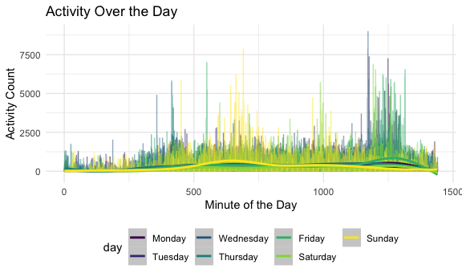

p8105\_hw3\_km3529
================
Karina Myers

## Problem 1

``` r
data("instacart")
```

This dataset contains 1384617 rows and 15 columns.

Observations are the level of items in orders by user. There are user
and order variables such as user ID, order ID, order day, and order
hour. There are also item variables such as product name, aisle,
department, whether the item has been ordered before, and some numeric
codes.

How many aisles are there, and which aisles are the most items ordered
from?

``` r
instacart %>% 
  count(aisle) %>% 
  arrange(desc(n))
```

    ## # A tibble: 134 x 2
    ##    aisle                              n
    ##    <chr>                          <int>
    ##  1 fresh vegetables              150609
    ##  2 fresh fruits                  150473
    ##  3 packaged vegetables fruits     78493
    ##  4 yogurt                         55240
    ##  5 packaged cheese                41699
    ##  6 water seltzer sparkling water  36617
    ##  7 milk                           32644
    ##  8 chips pretzels                 31269
    ##  9 soy lactosefree                26240
    ## 10 bread                          23635
    ## # … with 124 more rows

Make a plot that shows the number of items ordered in each aisle,
limiting this to aisles with more than 10000 items ordered. Arrange
aisles sensibly, and organize your plot so others can read it.

note: cat var will be ordered numerically –\> change to factor

``` r
instacart %>% 
  count(aisle) %>% 
  filter(n > 10000) %>% 
  mutate(
    aisle = factor(aisle), 
    aisle = fct_reorder(aisle, n)
  ) %>% 
  ggplot(aes(x = aisle, y = n)) + 
  geom_point() + 
    theme(axis.text.x = element_text(angle = 90, vjust = 0.5, hjust = 1))
```


Make a table showing the three most popular items in each of the aisles
“baking ingredients”, “dog food care”, and “packaged vegetables
fruits”. Include the number of times each item is ordered in your
table.

``` r
instacart %>% 
    filter(aisle %in% c("baking ingredients", "dog food care", "packaged vegetables fruits")) %>% 
  group_by(aisle) %>% 
  count(product_name) %>% 
  mutate(rank = min_rank(desc(n))) %>% 
  filter(rank < 4 ) %>% 
  arrange(aisle, rank) %>% 
knitr::kable()
```

| aisle                      | product\_name                                 |    n | rank |
| :------------------------- | :-------------------------------------------- | ---: | ---: |
| baking ingredients         | Light Brown Sugar                             |  499 |    1 |
| baking ingredients         | Pure Baking Soda                              |  387 |    2 |
| baking ingredients         | Cane Sugar                                    |  336 |    3 |
| dog food care              | Snack Sticks Chicken & Rice Recipe Dog Treats |   30 |    1 |
| dog food care              | Organix Chicken & Brown Rice Recipe           |   28 |    2 |
| dog food care              | Small Dog Biscuits                            |   26 |    3 |
| packaged vegetables fruits | Organic Baby Spinach                          | 9784 |    1 |
| packaged vegetables fruits | Organic Raspberries                           | 5546 |    2 |
| packaged vegetables fruits | Organic Blueberries                           | 4966 |    3 |

Make a table showing the mean hour of the day at which Pink Lady Apples
and Coffee Ice Cream are ordered on each day of the week; format this
table for human readers (i.e. produce a 2 x 7 table).

``` r
instacart %>% 
  filter(product_name %in% c("Pink Lady Apples", "Coffee Ice Cream")) %>% 
  group_by(product_name, order_dow) %>% 
  summarize(mean_hour = mean(order_hour_of_day)) %>% 
  pivot_wider(
    names_from = order_dow, 
    values_from = mean_hour
  )
```

    ## `summarise()` regrouping output by 'product_name' (override with `.groups` argument)

    ## # A tibble: 2 x 8
    ## # Groups:   product_name [2]
    ##   product_name       `0`   `1`   `2`   `3`   `4`   `5`   `6`
    ##   <chr>            <dbl> <dbl> <dbl> <dbl> <dbl> <dbl> <dbl>
    ## 1 Coffee Ice Cream  13.8  14.3  15.4  15.3  15.2  12.3  13.8
    ## 2 Pink Lady Apples  13.4  11.4  11.7  14.2  11.6  12.8  11.9

## Problem 2

Accelerometers have become an appealing alternative to self-report
techniques for studying physical activity in observational studies and
clinical trials, largely because of their relative objectivity.

During observation periods, the devices measure “activity counts” in a
short period; one-minute intervals are common. Because accelerometers
can be worn comfortably and unobtrusively, they produce around-the-clock
observations.

This problem uses five weeks of accelerometer data collected on a 63
year-old male with BMI 25, who was admitted to the Advanced Cardiac Care
Center of Columbia University Medical Center and diagnosed with
congestive heart failure (CHF). The data can be downloaded here. In this
spreadsheet, variables activity.\* are the activity counts for each
minute of a 24-hour day starting at midnight.

Notes: - 5 weeks of data - activity\_ : activity counts for each minute
of a 24 hour day

Load, tidy, and otherwise wrangle the data. Your final dataset should
include all originally observed variables and values; have useful
variable names; include a weekday vs weekend variable; and encode data
with reasonable variable classes. Describe the resulting dataset
(e.g. what variables exist, how many observations, etc).

``` r
accel_df = 
  read_csv("./Data/accel_data.csv") %>% 
  janitor::clean_names() %>% 
  pivot_longer(
      activity_1:activity_1440, 
      names_to = "minute",
      names_prefix = "activity_", 
      values_to = "activity_count") %>% 
  mutate(
    day_type = case_when(
        day %in% c("Monday", "Tuesday", "Wednesday", "Thursday", "Friday") ~ "weekday", 
        day %in% c("Saturday", "Sunday") ~ "weekend", 
        TRUE ~ "") , 
    activity_count = as.numeric(activity_count), 
    day = as.factor(day), 
    minute = as.numeric(minute), 
    day = forcats::fct_relevel(
        day, c("Monday", "Tuesday", "Wednesday", "Thursday", "Friday", "Saturday", "Sunday"))
    )
```

    ## Parsed with column specification:
    ## cols(
    ##   .default = col_double(),
    ##   day = col_character()
    ## )

    ## See spec(...) for full column specifications.

``` r
#just to check day_type var
accel_df %>% 
  distinct(day_type, )
```

    ## # A tibble: 2 x 1
    ##   day_type
    ##   <chr>   
    ## 1 weekday 
    ## 2 weekend

SUMMARY HERE

Traditional analyses of accelerometer data focus on the total activity
over the day. Using your tidied dataset, aggregate accross minutes to
create a total activity variable for each day, and create a table
showing these totals. Are any trends apparent?

``` r
accel_df %>% 
  group_by(day, week) %>% 
  summarize(daily_activity = sum(activity_count)) %>% 
  pivot_wider(
      names_from = week, 
      values_from = daily_activity) %>% 
  knitr::kable(digits = 1)
```

    ## `summarise()` regrouping output by 'day' (override with `.groups` argument)

| day       |        1 |      2 |      3 |      4 |      5 |
| :-------- | -------: | -----: | -----: | -----: | -----: |
| Monday    |  78828.1 | 295431 | 685910 | 409450 | 389080 |
| Tuesday   | 307094.2 | 423245 | 381507 | 319568 | 367824 |
| Wednesday | 340115.0 | 440962 | 468869 | 434460 | 445366 |
| Thursday  | 355923.6 | 474048 | 371230 | 340291 | 549658 |
| Friday    | 480542.6 | 568839 | 467420 | 154049 | 620860 |
| Saturday  | 376254.0 | 607175 | 382928 |   1440 |   1440 |
| Sunday    | 631105.0 | 422018 | 467052 | 260617 | 138421 |

TRENDS???? weeks 2 and three hav e alot of activity?

Accelerometer data allows the inspection activity over the course of the
day. Make a single-panel plot that shows the 24-hour activity time
courses for each day and use color to indicate day of the week. Describe
in words any patterns or conclusions you can make based on this graph.

``` r
# this works 
accel_df %>% 
  ggplot(aes(x = minute, y = activity_count, color = day)) + 
  geom_smooth(se = FALSE) 
```

    ## `geom_smooth()` using method = 'gam' and formula 'y ~ s(x, bs = "cs")'



``` r
### trying to make a mean variable? 
accel_df %>% 
  group_by(day)
```

    ## # A tibble: 50,400 x 6
    ## # Groups:   day [7]
    ##     week day_id day    minute activity_count day_type
    ##    <dbl>  <dbl> <fct>   <dbl>          <dbl> <chr>   
    ##  1     1      1 Friday      1           88.4 weekday 
    ##  2     1      1 Friday      2           82.2 weekday 
    ##  3     1      1 Friday      3           64.4 weekday 
    ##  4     1      1 Friday      4           70.0 weekday 
    ##  5     1      1 Friday      5           75.0 weekday 
    ##  6     1      1 Friday      6           66.3 weekday 
    ##  7     1      1 Friday      7           53.8 weekday 
    ##  8     1      1 Friday      8           47.8 weekday 
    ##  9     1      1 Friday      9           55.5 weekday 
    ## 10     1      1 Friday     10           43.0 weekday 
    ## # … with 50,390 more rows

## Problem 3

This problem uses the NY NOAA data. DO NOT include this dataset in your
local data directory; instead, load the data from the p8105.datasets
package using:

``` r
library(p8105.datasets)
data("ny_noaa")
```

WRITE DESCRIPTION

The goal is to do some exploration of this dataset. To that end, write a
short description of the dataset, noting the size and structure of the
data, describing some key variables, and indicating the extent to which
missing data is an issue. Then, do or answer the following (commenting
on the results of each):

Do some data cleaning. Create separate variables for year, month, and
day. Ensure observations for temperature, precipitation, and snowfall
are given in reasonable units. For snowfall, what are the most commonly
observed values? Why?

``` r
ny_noaa 
```

    ## # A tibble: 2,595,176 x 7
    ##    id          date        prcp  snow  snwd tmax  tmin 
    ##    <chr>       <date>     <int> <int> <int> <chr> <chr>
    ##  1 US1NYAB0001 2007-11-01    NA    NA    NA <NA>  <NA> 
    ##  2 US1NYAB0001 2007-11-02    NA    NA    NA <NA>  <NA> 
    ##  3 US1NYAB0001 2007-11-03    NA    NA    NA <NA>  <NA> 
    ##  4 US1NYAB0001 2007-11-04    NA    NA    NA <NA>  <NA> 
    ##  5 US1NYAB0001 2007-11-05    NA    NA    NA <NA>  <NA> 
    ##  6 US1NYAB0001 2007-11-06    NA    NA    NA <NA>  <NA> 
    ##  7 US1NYAB0001 2007-11-07    NA    NA    NA <NA>  <NA> 
    ##  8 US1NYAB0001 2007-11-08    NA    NA    NA <NA>  <NA> 
    ##  9 US1NYAB0001 2007-11-09    NA    NA    NA <NA>  <NA> 
    ## 10 US1NYAB0001 2007-11-10    NA    NA    NA <NA>  <NA> 
    ## # … with 2,595,166 more rows

Make a two-panel plot showing the average max temperature in January and
in July in each station across years. Is there any observable /
interpretable structure? Any outliers? Make a two-panel plot showing (i)
tmax vs tmin for the full dataset (note that a scatterplot may not be
the best option); and (ii) make a plot showing the distribution of
snowfall values greater than 0 and less than 100 separately by year.
