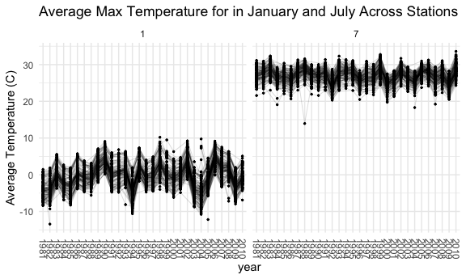
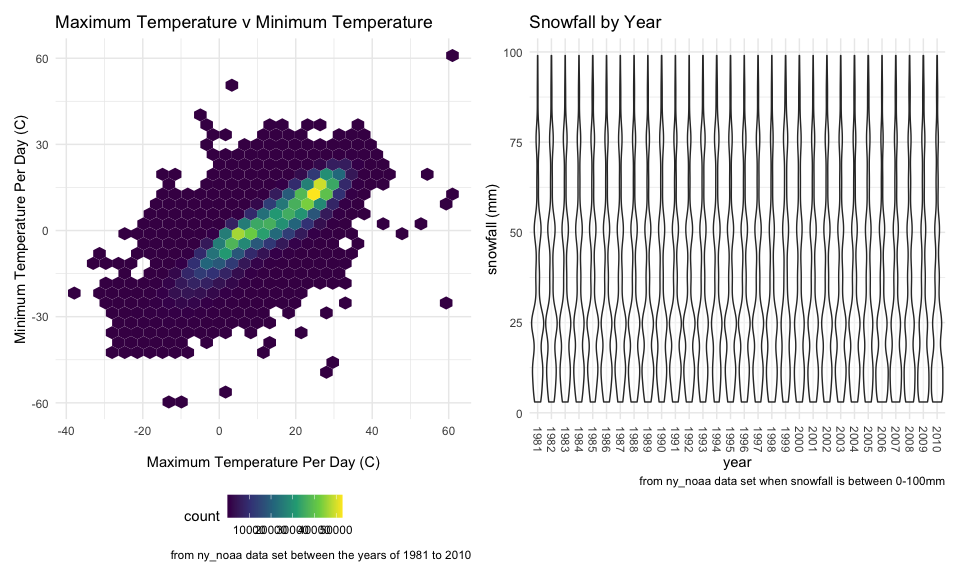

p8105\_hw3\_km3529
================
Karina Myers

## Problem 1

``` r
data("instacart")
```

This dataset contains 1384617 rows and 15 columns. Observations are the
level of items in orders by user. There are user and order variables
such as user ID, order ID, order day, and order hour. There are also
item variables such as product name, aisle, department, whether the item
has been ordered before, and some numeric codes.

How many aisles are there, and which aisles are the most items ordered
from?

``` r
instacart %>% 
  count(aisle) %>% 
  arrange(desc(n))
```

    ## # A tibble: 134 x 2
    ##    aisle                              n
    ##    <chr>                          <int>
    ##  1 fresh vegetables              150609
    ##  2 fresh fruits                  150473
    ##  3 packaged vegetables fruits     78493
    ##  4 yogurt                         55240
    ##  5 packaged cheese                41699
    ##  6 water seltzer sparkling water  36617
    ##  7 milk                           32644
    ##  8 chips pretzels                 31269
    ##  9 soy lactosefree                26240
    ## 10 bread                          23635
    ## # … with 124 more rows

Make a plot that shows the number of items ordered in each aisle,
limiting this to aisles with more than 10000 items ordered.

``` r
instacart %>% 
  count(aisle) %>% 
  filter(n > 10000) %>% 
  mutate(
    aisle = factor(aisle), 
    aisle = fct_reorder(aisle, n)
  ) %>% 
  ggplot(aes(x = aisle, y = n)) + 
  geom_point() + 
    theme(axis.text.x = element_text(angle = 90, vjust = 0.5, hjust = 1))
```


Make a table showing the three most popular items in each of the aisles
“baking ingredients”, “dog food care”, and “packaged vegetables
fruits”. Include the number of times each item is ordered in your
table.

``` r
instacart %>% 
    filter(aisle %in% c("baking ingredients", "dog food care", "packaged vegetables fruits")) %>% 
  group_by(aisle) %>% 
  count(product_name) %>% 
  mutate(rank = min_rank(desc(n))) %>% 
  filter(rank < 4 ) %>% 
  arrange(aisle, rank) %>% 
knitr::kable()
```

| aisle                      | product\_name                                 |    n | rank |
| :------------------------- | :-------------------------------------------- | ---: | ---: |
| baking ingredients         | Light Brown Sugar                             |  499 |    1 |
| baking ingredients         | Pure Baking Soda                              |  387 |    2 |
| baking ingredients         | Cane Sugar                                    |  336 |    3 |
| dog food care              | Snack Sticks Chicken & Rice Recipe Dog Treats |   30 |    1 |
| dog food care              | Organix Chicken & Brown Rice Recipe           |   28 |    2 |
| dog food care              | Small Dog Biscuits                            |   26 |    3 |
| packaged vegetables fruits | Organic Baby Spinach                          | 9784 |    1 |
| packaged vegetables fruits | Organic Raspberries                           | 5546 |    2 |
| packaged vegetables fruits | Organic Blueberries                           | 4966 |    3 |

Make a table showing the mean hour of the day at which Pink Lady Apples
and Coffee Ice Cream are ordered on each day of the week; format this
table for human readers (i.e. produce a 2 x 7 table).

``` r
instacart %>% 
  filter(product_name %in% c("Pink Lady Apples", "Coffee Ice Cream")) %>% 
  group_by(product_name, order_dow) %>% 
  summarize(mean_hour = mean(order_hour_of_day)) %>% 
  pivot_wider(
    names_from = order_dow, 
    values_from = mean_hour
  )
```

    ## `summarise()` regrouping output by 'product_name' (override with `.groups` argument)

    ## # A tibble: 2 x 8
    ## # Groups:   product_name [2]
    ##   product_name       `0`   `1`   `2`   `3`   `4`   `5`   `6`
    ##   <chr>            <dbl> <dbl> <dbl> <dbl> <dbl> <dbl> <dbl>
    ## 1 Coffee Ice Cream  13.8  14.3  15.4  15.3  15.2  12.3  13.8
    ## 2 Pink Lady Apples  13.4  11.4  11.7  14.2  11.6  12.8  11.9

## Problem 2

Load, tidy, and otherwise wrangle the data. Your final dataset should
include all originally observed variables and values; have useful
variable names; include a weekday vs weekend variable; and encode data
with reasonable variable classes. Describe the resulting dataset
(e.g. what variables exist, how many observations, etc).

``` r
accel_df = 
  read_csv("./Data/accel_data.csv") %>% 
  janitor::clean_names() %>% 
  pivot_longer(
      activity_1:activity_1440, 
      names_to = "minute",
      names_prefix = "activity_", 
      values_to = "activity_count") %>% 
  mutate(
    day_type = case_when(
        day %in% c("Monday", "Tuesday", "Wednesday", "Thursday", "Friday") ~ "weekday", 
        day %in% c("Saturday", "Sunday") ~ "weekend", 
        TRUE ~ "") , 
    activity_count = as.numeric(activity_count), 
    day = as.factor(day), 
    minute = as.numeric(minute), 
    day = forcats::fct_relevel(
        day, c("Monday", "Tuesday", "Wednesday", "Thursday", "Friday", "Saturday", "Sunday"))
    )
```

    ## Parsed with column specification:
    ## cols(
    ##   .default = col_double(),
    ##   day = col_character()
    ## )

    ## See spec(...) for full column specifications.

This dataset contains values from a 63 year old male’s accelerometer , a
small, unobtrusive device that measures activity. This data captures
values from his accelerometer over 5 weeks. This accelerometer measures
activity counts per minute, providing around the clock activity levels.
There are 50400 rows and 6 columns in this dataset. In addition to
activity count measured each minute, other key variables include week
number, day in the observation period, day of the week, and whether it
was a weekend or weekday.

Using your tidied dataset, aggregate across minutes to create a total
activity variable for each day, and create a table showing these totals.
Are any trends apparent?

``` r
accel_df %>% 
  group_by(day, week) %>% 
  summarize(daily_activity = sum(activity_count)) %>% 
  pivot_wider(
      names_from = day, 
      values_from = daily_activity) %>% 
  knitr::kable(digits = 1)
```

    ## `summarise()` regrouping output by 'day' (override with `.groups` argument)

| week |   Monday |  Tuesday | Wednesday | Thursday |   Friday | Saturday | Sunday |
| ---: | -------: | -------: | --------: | -------: | -------: | -------: | -----: |
|    1 |  78828.1 | 307094.2 |    340115 | 355923.6 | 480542.6 |   376254 | 631105 |
|    2 | 295431.0 | 423245.0 |    440962 | 474048.0 | 568839.0 |   607175 | 422018 |
|    3 | 685910.0 | 381507.0 |    468869 | 371230.0 | 467420.0 |   382928 | 467052 |
|    4 | 409450.0 | 319568.0 |    434460 | 340291.0 | 154049.0 |     1440 | 260617 |
|    5 | 389080.0 | 367824.0 |    445366 | 549658.0 | 620860.0 |     1440 | 138421 |

The patient’s activity varies quite a bit. For example, the two
Saturdays at the end of the observation period have a very low activity
count, while Saturday of week 2 had a very high activity count. Weeks 2
and 3 have higher activity compared to the others.

Make a single-panel plot that shows the 24-hour activity time courses
for each day and use color to indicate day of the week. Describe in
words any patterns or conclusions you can make based on this graph.

``` r
accel_df %>% 
  ggplot(aes(x = minute, y = activity_count, color = day)) + 
 geom_line(alpha = .5) + 
  geom_smooth(alpha = .5) + 
  labs(
    title = "Activity Over the Day", 
    x = "Minute of the Day", 
    y = "Activity Count"
  )
```

    ## `geom_smooth()` using method = 'gam' and formula 'y ~ s(x, bs = "cs")'


This plot shows the patient’s activity throughout the course of the day
by day of the week. The first 400 minutes of the day are very low
activity across all days of the week, which suggests this is when the
patient sleeps. The patient generally wakes up around 7:00 am (400
minutes), which is when activity count begins to increase each day.
Weekdays generally follow similar activity patterns, which may suggest a
consistent weekday schedule due to work or school. There is a slight
increase on activity Sunday mornings and Friday evenings. The patient is
most active during the weeks.

## Problem 3

This problem uses the NY NOAA data. DO NOT include this dataset in your
local data directory; instead, load the data from the p8105.datasets
package using:

``` r
library(p8105.datasets)
data("ny_noaa")
```

The goal is to do some exploration of this dataset. To that end, write a
short description of the dataset, noting the size and structure of the
data, describing some key variables, and indicating the extent to which
missing data is an issue. Then, do or answer the following (commenting
on the results of each). Do some data cleaning. Create separate
variables for year, month, and day. Ensure observations for temperature,
precipitation, and snowfall are given in reasonable units.

``` r
ny_noaa = 
  ny_noaa %>% 
  separate(date, into = c("year", "month", "day"), convert = TRUE) %>% 
  mutate(
    year = factor(year), 
    tmax = as.integer(tmax), 
    tmin = as.integer(tmin), 
    prcp = prcp/10, 
    tmax = tmax/10, 
    tmin = tmin/10
  )
```

This dataset was taken from NOAA, which contains weather and climate
records from over 100,000 stations across 180 countries and territories.
This subset from NOAA is on New York between the years of 1981 to 2010.
There are 2595176 rows and 9 columns. This datset contains values on
station, date, daily precipitation (mm), snowfall (mm), and daily
minimum/maximum temperatures (C).

For snowfall, what are the most commonly observed values? Why?

``` r
ny_noaa %>% 
  drop_na(snow) %>% 
  count(snow) %>% 
  mutate(rank = min_rank(desc(n))) %>% 
  filter(rank < 10)
```

    ## # A tibble: 9 x 3
    ##    snow       n  rank
    ##   <int>   <int> <int>
    ## 1     0 2008508     1
    ## 2     3    8790     9
    ## 3     5    9748     7
    ## 4     8    9962     6
    ## 5    13   23095     3
    ## 6    25   31022     2
    ## 7    38    9197     8
    ## 8    51   18274     4
    ## 9    76   10173     5

The most commonly observed values for snowfall was 0mm since New York
only snows during the winter. Other common values were 25mm, 38mm, and
13mm. These are also quite small since New York does not get very much
snow per day.

Make a two-panel plot showing the average max temperature in January and
in July in each station across years. Is there any observable /
interpretable structure? Any outliers?

``` r
ny_noaa %>% 
  filter(month %in% c("1", "7")) %>% 
  group_by(month, year, id) %>% 
  summarize(mean_tmax = mean(tmax, na.rm = TRUE)) %>% 
  ggplot(aes(x = year, y = mean_tmax, group = id)) + 
    geom_point(size = .5) +
    geom_path(alpha = .5, size = .1) + 
    facet_grid(.~month) + 
    theme(axis.text.x = element_text(angle = 270, vjust = 0.5, hjust = 1)) +
    labs(
      title = "Average Max Temperature for in January and July Across Stations", 
      y = "Average Temperature (C)")
```

    ## `summarise()` regrouping output by 'month', 'year' (override with `.groups` argument)

    ## Warning: Removed 5970 rows containing missing values (geom_point).

    ## Warning: Removed 5640 row(s) containing missing values (geom_path).



From this plot, July is much warmer than January every year. January of
1982 had one very cold day. The years 1994, 2003, and 2004 are colder
than the others. There is an outlier from July of 1988 that is close to
the January maximum temperature range. There is a slight shift in July
temperatures warming as the years pass. There is more variabiilty of
average maximum temperatures in January compared to July. We generally
see some stations are consistent from year to year, especially when
looking at the the January data for stations who report higher
temperatures.

Make a two-panel plot showing (i) tmax vs tmin for the full dataset
(note that a scatterplot may not be the best option); and (ii) make a
plot showing the distribution of snowfall values greater than 0 and less
than 100 separately by year.

``` r
#Plot 1
tmin_tmax_p = 
  ny_noaa %>% 
    drop_na(tmin, tmax) %>% 
    ggplot(aes(x = tmax, y = tmin)) + 
    geom_hex() + 
    labs(
      title = "Maximum Temperature v Minimum Temperature", 
      x = "Maximum Temperature Per Day (C)", 
      y = "Minimum Temperature Per Day (C)",  
      caption = "from ny_noaa data set between the years of 1981 to 2010")

#plot 2
snow_p = 
  ny_noaa %>% 
  drop_na(snow) %>% 
  filter(snow < 100) %>% 
  filter(snow > 0 ) %>% 
    ggplot(aes(x = year, y = snow)) + 
    geom_violin(alpha = .5) + 
    theme(axis.text.x = element_text(angle = 270, vjust = 0.5, hjust = 1)) +   labs(
      title = "Snowfall by Year", 
      x = "year", 
      y = "snowfall (mm)", 
      caption = "from ny_noaa data set when snowfall is between 0-100mm"
    )

tmin_tmax_p + snow_p
```


